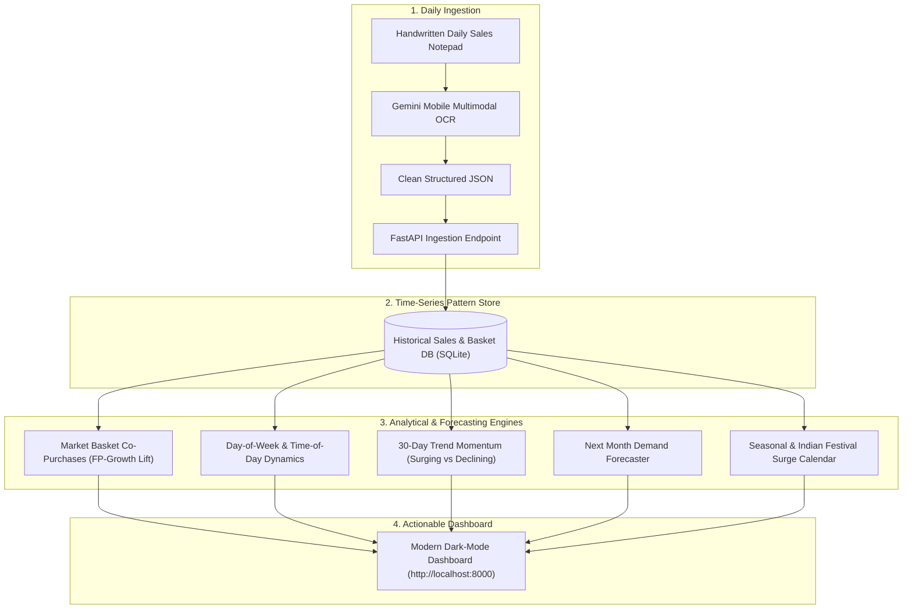

# Kirana Demand & Pattern Forecasting System
### AI-Powered Basket Intelligence, Trend Sensing & Multi-Season Demand Forecasting

---

## 1. System Mission & Focus

This system is built specifically for **Kirana and Convenience Store Retail Intelligence**, focusing on:
1. **Uncovering Customer Buying Patterns:** What items sell together in customer baskets, and how shopping behavior shifts across days of the week and times of day.
2. **Detecting Changing Trends:** Measuring period-over-period momentum to flag surging products vs. cooling products.
3. **Forecasting Future Demand:**
   - **Next Month SKU Projections:** Volume and revenue forecast per product based on run-rate, trend momentum, and upcoming seasonal multipliers.
   - **Seasonal Demand Shifts:** Weather-driven category swings (Summer cooling vs. Monsoon snacking vs. Winter staples).
   - **12-Month Indian Festival Surge Calendar:** Advance lead-time alerts for festivals (Navratri, Diwali, Holi, Makar Sankranti, Eid) with anticipated demand multipliers.

---

## 2. Architecture & Data Flow

---

## 3. Core Analytical Engines

### Module 1: Customer Buying Patterns (Basket Dynamics)
- **Pairwise Co-Occurrence & Lift:** Identifies pairs bought in the same bill with association confidence $> 70\%$ and lift $> 1.2$ (e.g., Tea leaves + Marie Gold/Parle-G; Maggi + Cold Drink).
- **Day-of-Week Behavior:** Analyzes weekday essential replenishment vs. weekend snacking surges, spend per basket, and basket drivers.

### Module 2: Changing Trends (Momentum Detection)
- Compares the recent 30-day run rate against the prior 30-day window:
  $$\text{Growth Momentum \%} = \frac{\text{Qty}_{\text{recent 30d}} - \text{Qty}_{\text{prior 30d}}}{\text{Qty}_{\text{prior 30d}}} \times 100$$
- **Surging Products:** Items gaining sudden velocity (e.g., Energy drinks, instant noodles, branded staples).
- **Declining Products:** Items losing velocity, signaling a shift in customer tastes or seasonal taper.

### Module 3: Predictive Demand Forecasting
- **Next Month Projection:**
  $$\text{Forecasted Qty} = \text{Run-Rate} \times (1 + \text{Damped Growth Rate}) \times \text{Seasonal Lift Factor}$$
  Provides specific **Stocking Directives** for every SKU.
- **Seasonal Multipliers:** Automatically applies demand lifts for Summer (beverages, curd), Monsoon (tea, instant snacks), and Winter (ghee, hot drinks).
- **Festival Calendar Roadmap:** 12-month forward roadmap identifying upcoming festivals, days remaining, urgency status (Critical / Upcoming / Advance), and surge percentages (+180% Sugar, +240% Besan, +210% Ghee) so you can order at wholesale before vendor prices rise.
