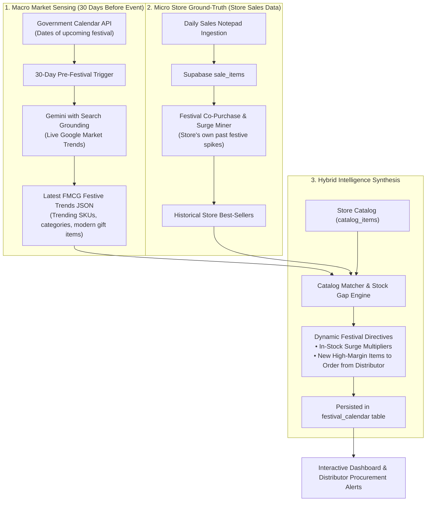

# Dynamic Indian Festival Trend Intelligence Architecture
### Moving from Hardcoded Surge Lists to Autonomous Market Trend Sensing

---

## 1. The Core Problem: Static Definitions vs. Shifting Consumer Culture

In traditional software, festive surge items are hardcoded (e.g., *Diwali = Loose Sugar + Besan + Desi Ghee*). However, Indian consumer behaviour evolves rapidly:

| Era | Traditional Festival Demand | Modern & Emerging Festival Trends |
| :--- | :--- | :--- |
| **Diwali** | Loose sugar, mawa, loose besan, mustard oil for diyas | Cadbury Celebrations gift packs, premium dry fruit hampers, branded ghee, air-fryer festive snacks, Ferrero Rocher |
| **Holi** | Loose gujiya ingredients, loose gulal | Instant Thandai syrups, packaged skin-safe herbal colors, tetra-pack juices, cold drink party crates, namkeen packs |
| **Navratri** | Loose rock salt, buckwheat flour | Branded packaged roasted makhana, tetra-pack coconut water, premium dahi cups, fasting chips (banana/potato) |
| **Raksha Bandhan** | Local halwai fresh sweets | Branded chocolate gift boxes, personalized snack packs, assorted biscuit tins |

If festive definitions remain hardcoded in code, the Kirana store misses the **highest-margin modern impulse items** and overstocks traditional commodities that may be slowing down.

---

## 2. Recommended Solution: The Hybrid Festive Trend Engine



---

## 3. How the 3 Layers Work

### Layer 1: Macro Market Trend Discovery (Gemini + Live Search Grounding)
Roughly **21 to 30 days before a festival** (detected dynamically via our Calendar API):
- A lightweight background task prompts Gemini equipped with Google Search Grounding:
  > *"Analyze current FMCG retail demand trends in India (specifically Uttar Pradesh / North India) for upcoming {festival_name} {current_year}. What are the latest consumer purchasing shifts, trending branded gift packs, snack items, beverages, and ingredients compared to previous years?"*
- Gemini searches live FMCG reports, trade articles, and retail blogs, returning a structured JSON payload:
  ```json
  {
    "festival": "Diwali 2026",
    "market_shift_summary": "Shift towards packaged chocolate gifting and premium dry fruits, alongside staples for home cooking.",
    "trending_categories": ["Premium Gifting", "Packaged Sweets", "Beverages", "Frying Staples"],
    "trending_products": [
      {"item_concept": "Cadbury Celebrations Box", "trend_type": "High Margin Gift", "expected_lift": "+250%"},
      {"item_concept": "Haldiram Soan Papdi / Gulab Jamun Tin", "trend_type": "Packaged Sweet", "expected_lift": "+200%"},
      {"item_concept": "Branded Desi Ghee 1L", "trend_type": "Core Cooking", "expected_lift": "+180%"},
      {"item_concept": "Cold Drink 2L Family Packs", "trend_type": "Celebration Refreshment", "expected_lift": "+150%"}
    ]
  }
  ```

### Layer 2: Micro Store Historical Pattern Mining (Ground-Truth)
While macro trends tell what is selling nationally, the store's own database reveals what this specific neighbourhood buys:
- The system queries Supabase for past sales where the notepad contained the festival tag (e.g., `festival ILIKE '%Diwali%'` or dates within 10 days of past festival dates).
- It extracts:
  1. SKUs with the highest velocity lift during past festive windows.
  2. Average basket size jump during festive days.

### Layer 3: Catalog Reconciliation & Distributor Gap Alert
The system compares the market trends against the store's `catalog_items`:
1. **Existing Catalog SKUs:** Dynamically updates their seasonal surge multiplier and stocking directive in `festival_calendar.surge_items`.
2. **Missing High-Potential SKUs (Distributor Procurement Opportunities):**
   - Flags items trending in the market that the shopkeeper does *not* currently stock (e.g., *"Cadbury Celebrations Gift Packs are trending +250% for Diwali; ask your distributor for 2 cartons 14 days in advance"*).

---

## 4. Database Schema: Fully Dynamic `festival_calendar`

Because `festival_calendar` already has `surge_categories` and `surge_items` as `JSONB` columns in Supabase:
```sql
-- Updated dynamically by the Trend Engine without changing database schemas
UPDATE festival_calendar
SET surge_categories = %s::jsonb,
    surge_items = %s::jsonb,
    updated_at = CURRENT_TIMESTAMP
WHERE festival_name = %s AND calendar_year = %s;
```

No hardcoded Python dictionaries needed. The Python code becomes an orchestrator that reads and writes dynamic retail intelligence.

---

## 5. Comparison: Hardcoded vs. Dynamic AI Trend Engine

| Capability | Hardcoded Static Definitions | Dynamic AI Market Trend Engine |
| :--- | :--- | :--- |
| **Adapts to Changing Consumer Tastes** | ❌ Never (Frozen in code) | ✅ Yes (Discovers shifts in gifting, snacks, and brands annually) |
| **New SKU Discovery** | ❌ Only tracks 4–5 hardcoded items | ✅ Recommends new high-margin items to stock from distributors |
| **Developer Maintenance** | ❌ Requires developer code changes | ✅ Zero developer maintenance |
| **Regional Relevance** | ⚠️ Generic national assumptions | ✅ Tunes to store's regional state (UP) and local customer bills |
| **Execution Cost** | Free | 1 API call per festival (triggered only ~6 times a year, virtually free) |

---

## 6. Implementation Plan for Milestone v0.0.5

1. **`festival_trend_analyzer.py`:** Dedicated module that queries Gemini (with market grounding) 25 days before upcoming festivals to generate the latest FMCG trend definition.
2. **Database Update Hook:** Persists dynamic surge items directly into Supabase `festival_calendar` table for the upcoming festival.
3. **Dashboard UI Integration:** Shows a badge: *"✨ Powered by Live Market Trend Sensing ({year} Edition)"* and displays newly recommended SKUs alongside core staples.
