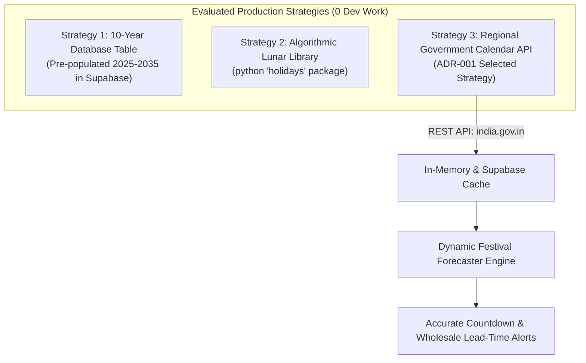

# Indian Festival Calendar: Long-Term Maintenance Architecture
### How Festival Dates Are Handled Now vs. Zero-Maintenance Production Strategy

---

## 1. The Core Problem: Shifting Lunar Dates

Unlike Western holidays with fixed Gregorian dates (like Christmas on Dec 25), most major Indian festivals (Diwali, Holi, Eid, Navratri, Raksha Bandhan, Janmashtami) follow **lunar and astronomical calendars** (Hindu Panchang / Islamic Hijri). 

- **Diwali 2024:** 31 October
- **Diwali 2025:** 20 October
- **Diwali 2026:** 08 November
- **Diwali 2027:** 29 October

If festival dates are hardcoded in code, a developer would need to manually update Python files every single year. For a production system requiring **zero developer intervention**, this is unacceptable.

---

## 2. Current State (Prototyping Baseline)

In the current prototype (`forecasting.py`), festival definitions were placed as a static Python list with approximate dates as a starting point. This proved the concept of:
- Calculating days-remaining countdowns.
- Categorizing urgency tiers (Critical, Upcoming, Advance).
- Applying pre-calibrated surge multipliers (Sugar $+180\%$, Besan $+240\%$).

---

## 3. Production Architecture: Evaluated Strategies & Selected ADR-001



---

### Selected Strategy (ADR-001): Regional Government Calendar API Sync

The system integrates directly with the **Official Indian Regional Calendar API**:
```
GET https://calendar-api-d7a8.onrender.com/v1/holidays?country=IN&region=UP&year={YEAR}
```
**Data Source:** Official Government of India Gazetted Calendar (`https://www.india.gov.in/calendar`).

#### Key Advantages & Strict Rate-Limit Safeguards:
1. **100% Authoritative & Deterministic:** Backed by published Government of India gazettes, eliminating LLM hallucinations or variations in lunar interpretation.
2. **State-Level Regional Granularity (`region=UP`):** Captures Uttar Pradesh state holidays, local festival observances (e.g., *Holika Dahan*, *Dussehra Mahashtami*, *Chhath Puja*, *Govardhan Puja*).
3. **Strict Rate-Limit Protection (Monthly / Daily Cadence):** The external API has very strict rate limits. The system is designed so that it is **NEVER** called per-request or during user dashboard interactions. Instead, a background sync script or cron job queries the API at most **once a month** (or once a year on January 1st).
4. **Persistent Supabase Storage:** Fetched holiday data is saved directly into the Supabase database (`festival_calendar` table). Runtime demand forecasting queries the database locally with zero network delay and zero API rate limit exposure.
5. **Zero Developer Maintenance for Any Year:** When a new calendar year arrives, the scheduled monthly sync requests `year={new_year}` automatically, maintaining the system indefinitely with zero code changes.
6. **No LLM Quota Overhead:** Standard REST JSON response; does not consume Gemini API tokens.

---

### Alternative Strategy 1: The 10-Year Supabase Table (Static Pre-Seeded)
Instead of live API calls, move the calendar to a pre-populated static table in Supabase via Flyway migration (`V4__seed_10year_festival_calendar.sql`) with dates from 2025 to 2035.

---

### Alternative Strategy 2: Python Astronomical & Holiday Package (`holidays` library)
Use the Python open-source `holidays` package (`pip install holidays`) which includes built-in lunar algorithms for Indian holidays. (Limited in tracking multi-day shopping preparation phases).

---

## 4. How the Notepad Itself Validates & Refines Festivals

Notice the last column of your daily notepad: `[festival]`.

When you write:
```text
sale no. 5 | 07:30 PM | 1 ghee 1L, 2kg cheeni | 755 | Pleasant | Navratri Day 1
```

1. The system detects your manual annotation: `Navratri Day 1`.
2. It cross-references the date (`07/10/2026`) with the calendar table.
3. If there is a slight local variation (e.g., local fasting starts a day earlier based on local temple timing), the system **adapts to your local store's actual rhythm**, logging historical surges against your exact calendar.

---

## 5. Implementation Roadmap (Next Milestone Proposal)

For our next milestone, we can implement **Strategy 1**:
1. Create `migrations/V4__festival_calendar_table.sql` (Flyway DDL).
2. Create `migrations/V5__seed_multiyear_festivals.sql` (Pre-seeding 2025–2035 astronomical dates).
3. Update `forecasting.py` to read dynamically from Supabase instead of the static Python list.
