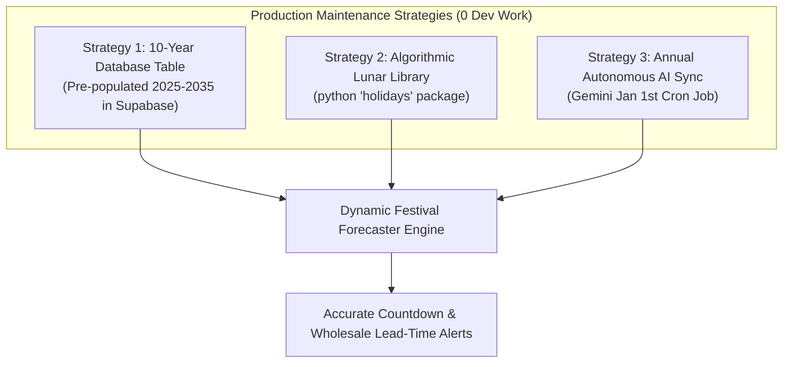

# Indian Festival Calendar: Long-Term Maintenance Architecture
### How Festival Dates Are Handled Now vs. Zero-Maintenance Production Strategy

---

## 1. The Core Problem: Shifting Lunar Dates

Unlike Western holidays with fixed Gregorian dates (like Christmas on Dec 25), most major Indian festivals (Diwali, Holi, Eid, Navratri, Raksha Bandhan, Janmashtami) follow **lunar and astronomical calendars** (Hindu Panchang / Islamic Hijri). 

- **Diwali 2024:** 31 October
- **Diwali 2025:** 20 October
- **Diwali 2026:** 08 November
- **Diwali 2027:** 29 October

If festival dates are hardcoded in code, a developer would need to manually update Python files every single year. For a production system requiring **zero developer intervention**, this is unacceptable.

---

## 2. Current State (Prototyping Baseline)

In the current prototype (`forecasting.py`), festival definitions were placed as a static Python list with approximate dates as a starting point. This proved the concept of:
- Calculating days-remaining countdowns.
- Categorizing urgency tiers (Critical, Upcoming, Advance).
- Applying pre-calibrated surge multipliers (Sugar $+180\%$, Besan $+240\%$).

---

## 3. Production Architecture: 3 Zero-Maintenance Solutions



---

### Strategy 1: The 10-Year Supabase Table (Recommended — Simplest & 100% Reliable)

Instead of hardcoding dates in Python, we move the calendar to a dedicated table in Supabase via a Flyway migration:

```sql
CREATE TABLE IF NOT EXISTS festival_calendar (
    id SERIAL PRIMARY KEY,
    festival_name VARCHAR(100) NOT NULL,
    calendar_year INTEGER NOT NULL,
    festival_date DATE NOT NULL,
    prep_lead_days INTEGER DEFAULT 14,
    surge_categories JSONB,
    surge_items JSONB,
    UNIQUE(festival_name, calendar_year)
);
```

#### Why this requires ZERO development work for 10 years:
- A single Flyway migration script (`V4__seed_10year_festival_calendar.sql`) pre-loads all official Hindu, Islamic, and national festival dates for **2025 through 2035**.
- The Python engine simply runs:
  ```sql
  SELECT festival_name, festival_date, surge_items
  FROM festival_calendar
  WHERE festival_date >= CURRENT_DATE
  ORDER BY festival_date ASC
  LIMIT 5;
  ```
- No code changes, no API failures, zero maintenance until 2035.

---

### Strategy 2: Python Astronomical & Holiday Package (`holidays` library)

The Python ecosystem includes the open-source `holidays` library (`pip install holidays`), which includes built-in lunar algorithms for Indian regional and national festivals:

```python
import holidays
# Automatically computes exact lunar dates for ANY year without external APIs
in_festivals = holidays.India(years=[2026, 2027, 2028])
```

- **Pros:** Completely algorithmic, works offline, never expires.
- **Cons:** Only tracks major public holidays; regional shopping events (e.g. Navratri Fasting weeks or Dhanteras shopping day) still need custom offset rules.

---

### Strategy 3: Autonomous Annual AI Sync (Self-Updating Agent)

Since your system is already integrated with Gemini:
- On **January 1st of every year**, an automated lightweight background job runs:
  > *"Prompt Gemini: Return a JSON array of the exact dates of Diwali, Navratri, Holi, Eid, Raksha Bandhan, and Makar Sankranti for Year {current_year}."*
- The result is automatically inserted into the Supabase `festival_calendar` table.
- **Result:** The system maintains itself indefinitely into the future with zero human touch.

---

## 4. How the Notepad Itself Validates & Refines Festivals

Notice the last column of your daily notepad: `[festival]`.

When you write:
```text
sale no. 5 | 07:30 PM | 1 ghee 1L, 2kg cheeni | 755 | Pleasant | Navratri Day 1
```

1. The system detects your manual annotation: `Navratri Day 1`.
2. It cross-references the date (`07/10/2026`) with the calendar table.
3. If there is a slight local variation (e.g., local fasting starts a day earlier based on local temple timing), the system **adapts to your local store's actual rhythm**, logging historical surges against your exact calendar.

---

## 5. Implementation Roadmap (Next Milestone Proposal)

For our next milestone, we can implement **Strategy 1**:
1. Create `migrations/V4__festival_calendar_table.sql` (Flyway DDL).
2. Create `migrations/V5__seed_multiyear_festivals.sql` (Pre-seeding 2025–2035 astronomical dates).
3. Update `forecasting.py` to read dynamically from Supabase instead of the static Python list.
