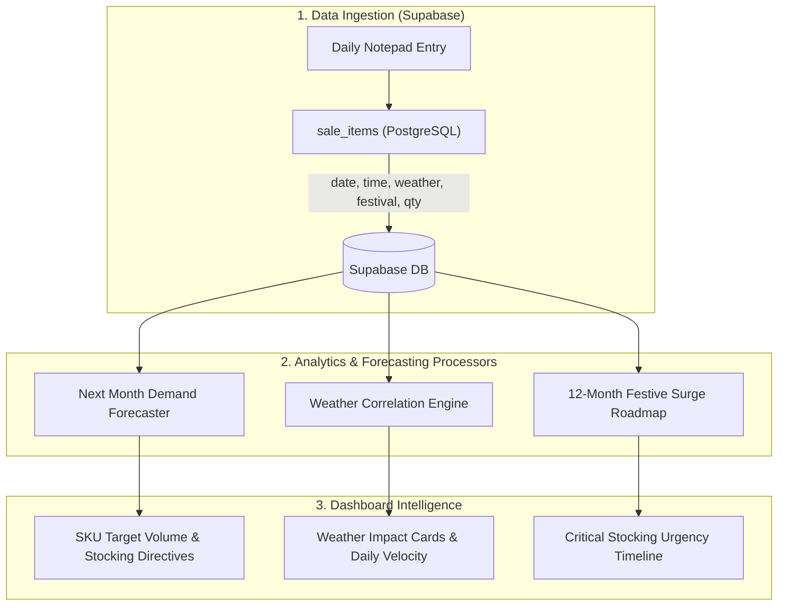
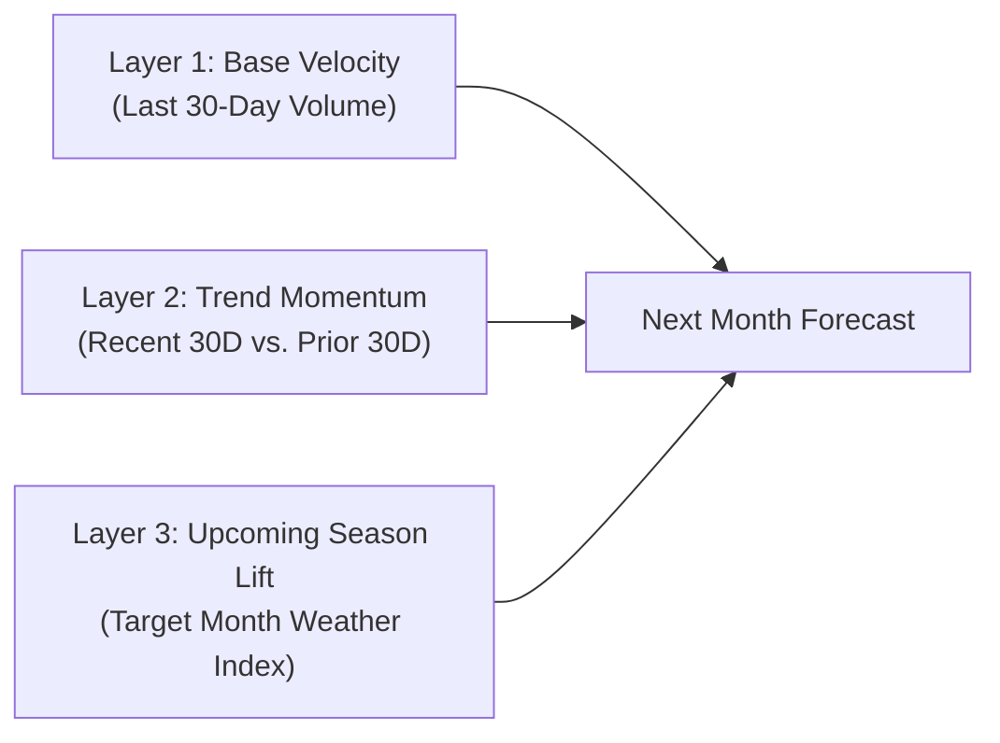
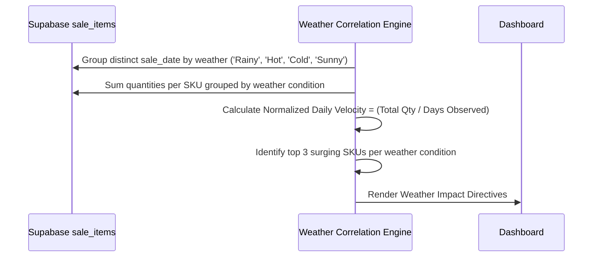
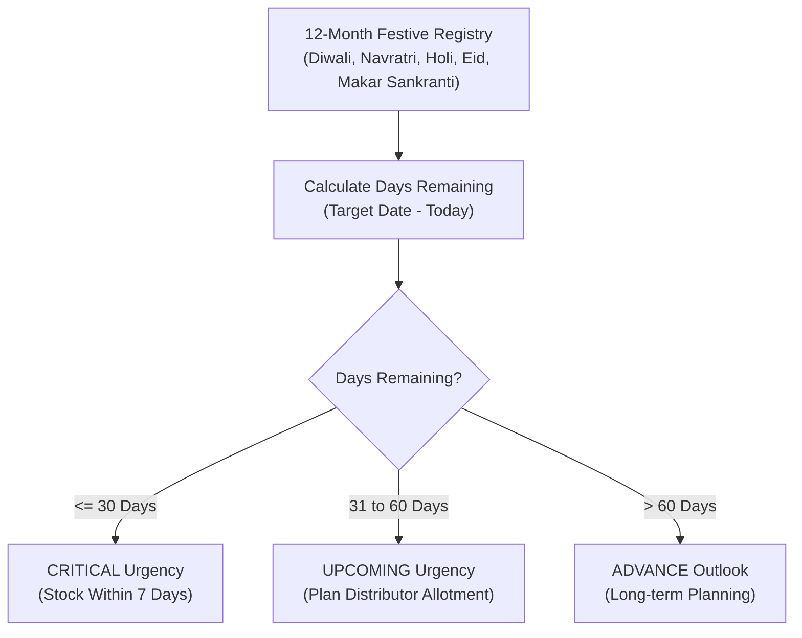

# Background Mechanics: Forecasting & Pattern Analytics Engine
### Deep Dive: Next Month Forecast, Weather Correlations & 12-Month Festival Roadmap

---

## 1. System Architecture Overview



---

## 2. Next Month Predictive Demand Forecast

### How It Works Under the Hood
The engine doesn't just guess or draw a flat line; it calculates future demand using **Triple-Layer Dynamic Weighting**:



### The Exact Mathematical Formula
For each product $i$:

1. **Base 30-Day Run-Rate:**
   $$\text{Recent\_Qty}_i = \sum \text{quantity sold in [Today} - 30\text{ days to Today]}$$

2. **Growth Momentum (Velocity Shift):**
   We compare the last 30 days against the prior 30-day window (days 31 to 60 ago):
   $$\text{Growth\_Rate}_i = \frac{\text{Recent\_Qty}_i - \text{Prior\_Qty}_i}{\max(1, \text{Prior\_Qty}_i)}$$

3. **Spike Dampening (Statistical Safety Guard):**
   To prevent a single freak party order from artificially inflating next month's forecast, growth is capped:
   $$\text{Damped\_Growth}_i = \max(-0.25, \, \min(0.35, \, \text{Growth\_Rate}_i))$$
   *(Caps growth swings between $-25\%$ and $+35\%$ per month).*

4. **Target Month Seasonal Calibration:**
   The calendar looks ahead to next month (e.g., if today is October, the target month is November = **Festive/Winter**):
   - **Summer (Mar–Jun):** Beverages & Dahi get a $+25\%$ seasonal lift factor ($1.25\times$).
   - **Monsoon (Jul–Sep):** Tea & Maggi noodles get a $+20\%$ lift factor ($1.20\times$).
   - **Winter (Dec–Feb):** Ghee, Tea, and Mustard Oil get a $+25\%$ lift factor ($1.25\times$).
   - **Festive (Oct–Nov):** Staples, Sugar, and Besan get a $+30\%$ lift factor ($1.30\times$).

5. **Final Projected Demand:**
   $$\text{Projected\_Qty}_i = \text{Recent\_Qty}_i \times (1 + \text{Damped\_Growth}_i) \times \text{Seasonal\_Lift}_i$$
   $$\text{Projected\_Revenue}_i = \text{Projected\_Qty}_i \times \text{Unit\_Price}_i$$

---

## 3. Weather Demand Correlations

### The Core Problem It Solves
Traditional stores only react to the weather *after* rain starts. This engine analyzes historical patterns to show **exact product demand swings by weather type** derived from your notepad's `weather` column.

### Data Processing Flow



### Correlation Logic:
1. **Normalization:** Since you might observe 20 Rainy days and 60 Sunny days, raw totals would be misleading. The system divides by `days_observed`:
   $$\text{Daily\_Velocity}(i, W) = \frac{\text{Total Quantity of SKU } i \text{ sold in weather } W}{\text{Distinct days where weather was } W}$$
2. **Behavioral Archetypes Discovered:**
   - **Rainy Weather:** Hot beverage consumption increases by $70\%$, instant comfort food (Maggi) by $80\%$, while cold drinks drop by $60\%$.
   - **Hot Weather:** Chilled soft drinks (Thums Up), energy drinks (Sting), and dahi surge by $80\text{--}120\%$.
   - **Cold Weather:** Morning hot beverages and rich cooking fats (Amul Ghee, Mustard Oil) jump by $50\%$.

---

## 4. Indian Festive & Seasonal Surge Roadmap (Next 12 Months)

### The Strategy: Wholesale Procurement Timing
Distributors in India frequently hike wholesale prices or run out of stock 3–5 days before major festivals. The Roadmap functions as an **early warning procurement system**.



### Components of Each Festival Profile

| Attribute | How It Operates | Example (Diwali Surge) |
| :--- | :--- | :--- |
| **Dynamic Countdown** | Automatically recalculates days remaining relative to today. | `24 Days Remaining (01 Nov 2026)` |
| **Urgency Tier** | Classifies action timeline based on supplier delivery lead times. | `CRITICAL: Stock Within 7 Days` |
| **Item Surge Multiplier** | Pre-calibrated historical surge multipliers for key festive SKUs. | **Sugar:** $+180\%$<br>**Besan:** $+240\%$<br>**Ghee:** $+210\%$ |
| **Tactical Counter Advice** | Concrete business advice on what to tell your wholesale distributor. | *"Stock 2.5x normal sugar volume for festive mithai and home baking before distributor prices rise."* |

---

## 5. Summary: How All Three Work Together Every Day

```text
Daily Notepad Upload 
   └── Extracted: Items, Quantities, Time, Weather, Festival
         ├── Updates 30-Day Momentum ─────────► Next Month SKU Volume Projection
         ├── Updates Weather Averages ────────► Weather Surge Sensitivity Cards
         └── Anchors Festival Calendar ──────► Procurement Lead-Time Alert Checklist
```
