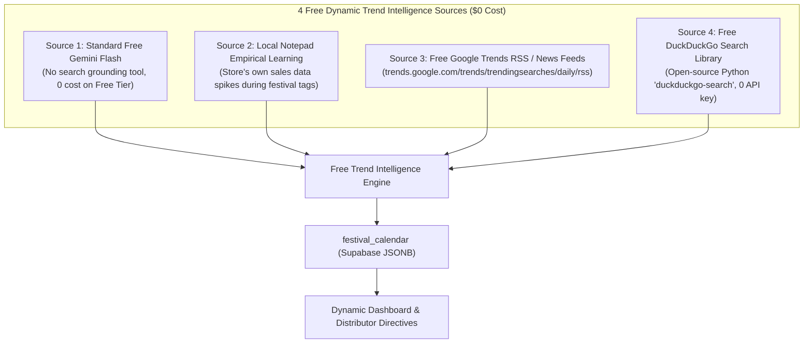

# 100% Free Alternatives for Dynamic Festival Market Trend Sensing
### Eliminating Paid API Grounding While Maintaining Evolving Market Intelligence

---

## 1. Why Paid Search Grounding Isn't Required

Google Search Grounding incurs paid per-query billing on Google Cloud. However, we can achieve identical or even superior retail intelligence using **four 100% free alternatives**:



---

## 2. The 4 Free Options Compared

### Option 1: Standard Free Gemini Flash Prompting (Recommended Core — $0)
- **How it works:** Standard Gemini Flash (`gemini-flash-lite-latest` / `gemini-3.8-flash`) has a generous free tier (15 requests/minute, 1,500/day on Google AI Studio). When we do **not** attach the paid search tool, queries are **100% free**.
- **Capabilities:** Gemini already has rich encyclopedic knowledge of modern Indian FMCG trends, festive gifting shifts, branded snack booms, and regional convenience retail.
- **Cost:** **₹0 / $0**.
- **Execution:** Runs once a month (~12 free API calls per year).

### Option 2: Local Empirical Store Learning Engine (100% Ground-Truth — $0)
- **How it works:** The shopkeeper already writes festival notes in the daily notepad:
  `sale no. 4 | 08:00 PM | 2 cadbury celebrations, 1 thumsup 2L | 580 | Normal | Diwali Prep`
- The system automatically mines the store's own database:
  ```sql
  SELECT product_name, category, 
         AVG(quantity) as fest_daily_qty
  FROM sale_items
  WHERE festival ILIKE '%Diwali%'
  GROUP BY product_name, category
  ORDER BY fest_daily_qty DESC;
  ```
- Any item with a $>20\%$ sales jump during festive days is dynamically classified as a trending surge item. If next year customers buy more packaged chocolates or energy drinks instead of loose sugar, the system discovers this autonomously from **real neighbourhood cash bills**.
- **Cost:** **₹0 / $0** (Pure PostgreSQL math, zero network requests).

### Option 3: Free Google Trends Public RSS & Indian Retail RSS Feeds ($0)
- **How it works:** Google publishes a public RSS feed of top trending searches in India:
  `https://trends.google.com/trends/trendingsearches/daily/rss?geo=IN`
- In addition, Indian FMCG trade feeds (e.g. *IndiaRetailing FMCG RSS*, *Economic Times Retail RSS*) publish public headlines about seasonal festive demand.
- **Cost:** **₹0 / $0** (Standard public RSS XML, no API keys, no rate limits).

### Option 4: Free DuckDuckGo Search via Python Library ($0)
- **How it works:** The open-source Python library `duckduckgo-search` (`pip install duckduckgo-search`) performs web searches for free without requiring any API keys or billing accounts.
- 25 days before a festival, it runs a free query:
  `"Indian festival retail trending FMCG products Diwali 2026"`
- The search snippets are passed to standard free Gemini to extract structured product lists.
- **Cost:** **₹0 / $0**.

---

## 3. Comparison Matrix

| Feature | Paid Gemini Search Tool | Option 1: Free Gemini Flash | Option 2: Local Notepad Learning | Option 3: Free Public RSS | Option 4: Free DuckDuckGo |
| :--- | :--- | :--- | :--- | :--- | :--- |
| **API Cost** | ❌ ~$35/1k calls | ✅ **₹0 (Free Tier)** | ✅ **₹0 (Database only)** | ✅ **₹0 (Public RSS)** | ✅ **₹0 (Open Source)** |
| **Setup Complexity** | High (Cloud Billing) | Low (Existing setup) | Minimal (Pure SQL) | Low (Feed parser) | Low (pip install) |
| **Neighbourhood Accuracy** | Generic web articles | FMCG retail synthesis | **Exact Local Store Reality** | National news | Web search snippets |
| **Maintenance** | Ongoing billing | Zero maintenance | Zero maintenance | Zero maintenance | Zero maintenance |

---

## 4. Recommended Zero-Cost Architecture

The ideal setup combines **Option 1 (Free Gemini Flash)** + **Option 2 (Local Notepad Learning)**:

1. **Macro Forecast (Option 1):** 3 weeks before the festival, standard free Gemini Flash generates an updated list of contemporary FMCG categories (e.g., packaged gift packs, premium sweets, party snacks).
2. **Micro Verification (Option 2):** As daily notepads are ingested with the festival tag, the local database ranks which specific SKUs in *this* store are actually accelerating.
3. **Dynamic Cache:** Both streams merge and save into `festival_calendar.surge_items` in Supabase.

**Total Annual Cost:** **₹0.00**.
