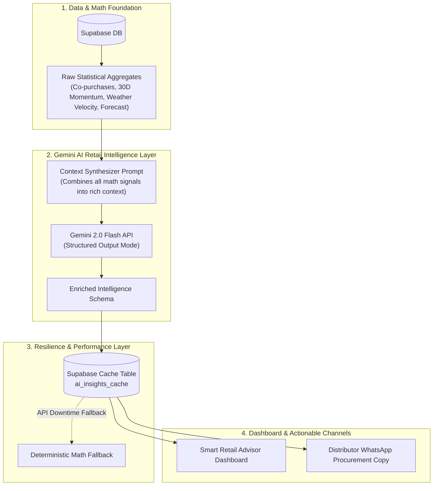

# Gemini AI Analytics Enrichment Plan
### Transforming Raw Statistics into Context-Aware Retail Intelligence

---

## 1. Problem Statement: Current Gap

Currently, the analytics engine computes raw mathematical outputs:
- **Co-purchases:** `Maggi + Thums Up`, count `334`, lift `7.24` (static template: *"Place item B next to item A"*).
- **Weather:** `Rainy`: Tea `~15/day`, Maggi `~12/day` (static template).
- **Trends:** `Sting` $+65\%$, `Loose Sugar` $-10\%$.
- **Next Month Forecast:** Formulaic quantity `180 units`.

### The Desired State
Instead of generic templates and raw numbers, **Gemini 2.0 Flash** acts as an **expert retail consultant for the Kirana store**, synthesizing multi-dimensional signals (Baskets + Weather + Time-of-Day + Festive countdowns + Momentum) into **meaningful, narrative-driven business decisions**.

---

## 2. End-to-End System Architecture



---

## 3. Four Core AI Enrichment Modules

### Module A: Context-Aware Merchandising & Combo Engine
- **Input:** Top co-purchase pairs, lift scores, time of day, and weather.
- **Gemini Transformation:**
  - Explains the **consumer habit behind the pairing** (e.g. *Why are people buying Cigarettes + Ice Cream at 9 PM? Late-night treat after dinner*).
  - Generates **catchy, high-margin combo promotions** (e.g., *"Late-Night Sweet Break: Buy a pack of Classic Milds + Amul Chocobar for ₹85 (₹5 discount) placed at the checkout glass counter"*).
  - Directs **exact physical shelf placement** tailored to a 100–300 sq. ft. Kirana counter.

### Module B: Tactical Weather & Time-of-Day Directives
- **Input:** Today's weather, forecasted weather, and hourly purchase spikes.
- **Gemini Transformation:**
  - *"Heavy rain expected this evening: Move Maggi and 250g Red Label Tea packets to front eye-level shelving by 4 PM. Pre-chill 20% fewer cold drinks to save refrigeration power; prioritize keeping milk and savory snacks dry."*

### Module C: Wholesale Procurement & Distributor Advisory
- **Input:** Next-month SKU forecasts + Festival Calendar countdown (e.g., Diwali in 24 days).
- **Gemini Transformation:**
  - Translates projected units into **wholesale distributor packs** (e.g., *180 packets $\rightarrow$ 6 wholesale cartons of 30*).
  - Provides **distributor negotiation intelligence**:
    > *"Sugar and Besan wholesale rates will rise ~8–12% within the next 10 days as festive demand surges city-wide. Order 5 bags of Sugar (50kg each) and 4 boxes of Besan this Wednesday to lock in current wholesale prices."*

### Module D: Product Momentum & "Why-Behind-The-Trend" Analysis
- **Input:** Fastest surging items (+65% Sting) vs declining items (-10% Loose Sugar).
- **Gemini Transformation:**
  - Explains the **market shift**:
    > *"Loose sugar demand is tapering as younger customers migrate to packaged branded sugar (cleanliness/hygiene). Consider reducing your loose commodity gunny bag space and allocating half that shelf space to 1kg branded sugar packets."*

---

## 4. Performance, Cost & Failsafe Architecture

To keep the application fast, low-cost, and robust:

### 1. Smart Caching Strategy (Zero Wasted API Calls)
- Gemini is **NOT called on every browser page load**.
- Instead, insights are cached in a new Supabase table: `ai_insights_cache`.
- **Cache Invalidation Triggers:**
  1. Whenever a new daily sales notepad is ingested.
  2. Or when the user explicitly clicks **"Refresh AI Insights"**.
- Result: **Only 1 to 2 Gemini API calls per day**, costing less than $0.001/day.

### 2. High-Integrity Structured Output
- Uses Gemini's `response_mime_type="application/json"` with an explicit JSON Schema / Pydantic contract to eliminate hallucinated formatting errors:
  ```json
  {
    "daily_strategic_brief": "Executive summary for the store owner",
    "top_merchandising_combos": [...],
    "weather_tactical_action": "Immediate counter action",
    "wholesale_procurement_advice": [...],
    "trend_explanations": [...]
  }
  ```

### 3. Graceful Fallback Guarantee
- If Gemini API is unreachable (network timeout or quota exceeded), the system **instantly and silently falls back** to the deterministic mathematical baseline without breaking the UI.

---

## 5. Implementation Roadmap (Milestone Breakdown)

| Phase | Deliverable | Scope |
| :--- | :--- | :--- |
| **Phase 1: Database Migration** | `V4__ai_insights_cache.sql` | Flyway DDL migration for caching enriched intelligence in Supabase. |
| **Phase 2: Core AI Enricher** | `gemini_enricher.py` | Python module connecting raw analytics aggregates to Gemini 2.0 Flash structured JSON. |
| **Phase 3: API & Cache Layer** | Update `main.py` & `analytics.py` | Seamless integration of cache lookup, on-ingest invalidation, and fallback logic. |
| **Phase 4: Dashboard UI Upgrade** | Enhanced Frontend | Replace static cards with the **Gemini AI Retail Strategic Advisor** card and enriched combo directives. |
