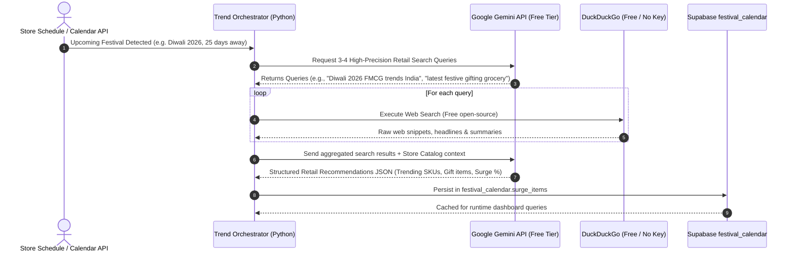

# Gemini + DuckDuckGo Autonomous Festival Trend Pipeline
### Free, Web-Grounded Retail Intelligence Loop ($0 Cost Architecture)

---

## 1. Flow Overview & Architecture

This flow creates a zero-cost **Agentic Web-Search Loop**:



---

## 2. Detailed 4-Step Execution Pipeline

### Step 1: Query Generation (Gemini)
Instead of relying on a human to guess what to search, Gemini acts as a prompt engineer:
- **Input:** Festival Name, Year, Regional Focus (e.g., Uttar Pradesh, India).
- **Prompt:**
  > *"Generate 3 distinct, high-yield web search queries to discover the latest FMCG, grocery, and confectionery retail demand trends for {festival} {year} in North India. Focus on: (1) Emerging gifting hampers/packaged sweets, (2) Cooking staples & fasts, (3) Snacks & cold beverages."*
- **Gemini Output (JSON):**
  ```json
  [
    "Diwali 2026 FMCG packaged sweets gifting trends India",
    "Kirana store fastest selling grocery items Diwali 2026",
    "latest consumer festive gifting chocolate hampers dry fruits India"
  ]
  ```

### Step 2: Keyless Live Web Execution (DuckDuckGo)
The Python engine queries DuckDuckGo for each query:
- Uses `duckduckgo-search` library (or direct `httpx` DuckDuckGo HTML endpoint).
- **Zero API keys required**, no credit card, no quotas, 100% free.
- Fetches top 4–5 snippet summaries per query (titles, URLs, excerpts).

### Step 3: Synthesis & Structuring (Gemini)
The raw web text is sent back to Gemini in a structured synthesis prompt:
- **Input:** Raw search snippets + Current Kirana product catalog.
- **Instruction:**
  > *"Analyze these current web search snippets about {festival} {year}. Filter out noise. Identify real consumer buying shifts, trending brands, and high-margin product opportunities. Compare against the Kirana catalog and return a structured JSON roadmap."*
- **Structured Output:**
  ```json
  {
    "festival": "Diwali 2026",
    "market_shift_summary": "Strong shift toward branded chocolate gifting packs (Cadbury Celebrations, Ferrero) and premium dry fruit tins, alongside traditional ghee and besan for home cooking.",
    "trending_categories": ["Packaged Gifting", "Staples", "Beverages"],
    "surge_items": [
      {
        "item": "Cadbury Celebrations Box",
        "surge_pct": 250,
        "prep_advice": "Order 3 cartons 14 days early; replaces traditional loose mithai."
      },
      {
        "item": "Amul Pure Ghee 1L",
        "surge_pct": 210,
        "prep_advice": "Essential for festival cooking; lock distributor price early."
      },
      {
        "item": "Haldiram Aloo Bhujia 200g",
        "surge_pct": 180,
        "prep_advice": "High demand for family hosting snacks."
      }
    ]
  }
  ```

### Step 4: Supabase Persistence & Zero-Latency Serving
- The synthesized `surge_items` and `surge_categories` are saved directly to `festival_calendar` in Supabase.
- When the shopkeeper opens the dashboard or requests forecasts, the data loads **instantly from Supabase** with zero network delay and zero API calls.

---

## 3. Cost & Quota Analysis

| Component | Provider | Quota / Tier | Actual Cost |
| :--- | :--- | :--- | :--- |
| **Query Generator** | Gemini Flash | Google AI Studio Free Tier (1,500 req/day) | **₹0 / $0** |
| **Web Search** | DuckDuckGo | Open-Source / Public | **₹0 / $0** |
| **Trend Synthesizer** | Gemini Flash | Google AI Studio Free Tier | **₹0 / $0** |
| **Database Storage** | Supabase PostgreSQL | Free Tier | **₹0 / $0** |
| **Total Pipeline Cost** | — | — | **₹0.00** |

---

## 4. Resilience & Graceful Fallback Safeguards

1. **DuckDuckGo Rate-Limit / Timeout Protection:**
   If DuckDuckGo encounters network latency or blocks a query, the synthesizer automatically falls back to Gemini's internal knowledge base + past local store sales without crashing.
2. **Scheduled Cadence:**
   This pipeline only needs to run **once per upcoming festival** (roughly ~6 times per year), completely eliminating any risk of rate limits or unnecessary overhead.
