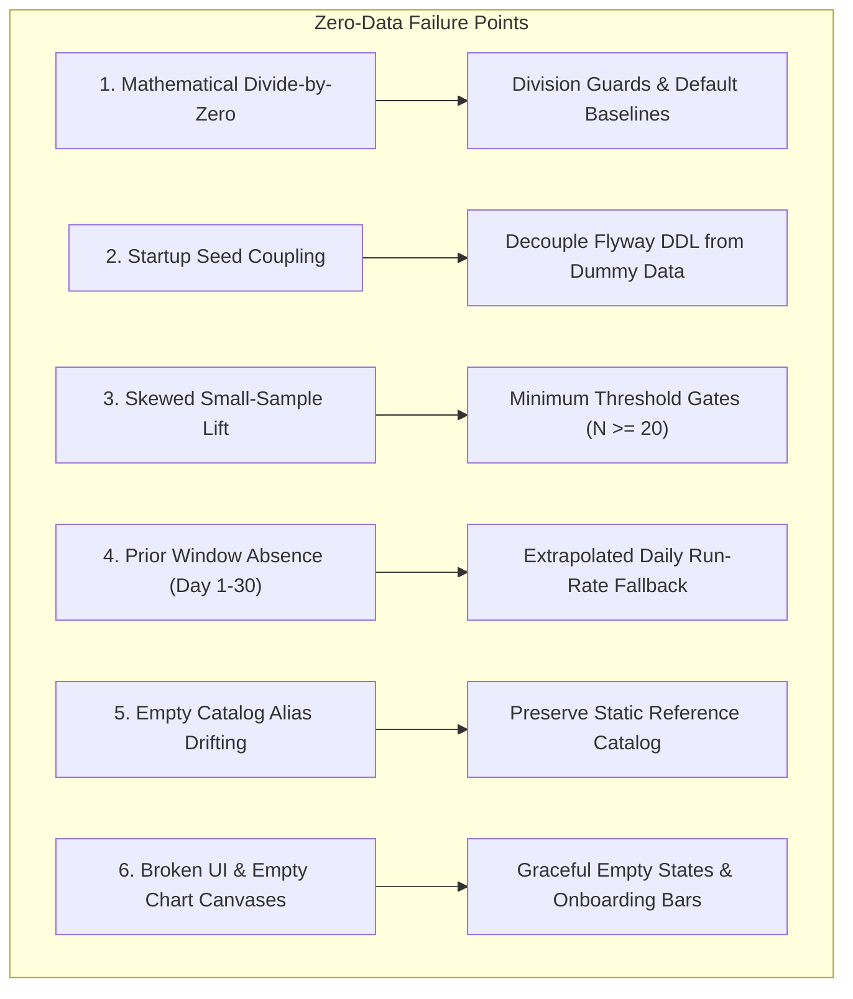

# Production Cold-Start & Zero-Dummy-Data Analysis
### Eliminating Synthetic Data: Edge Cases, Math Guards & Phased Unlocking

---

## 1. Executive Summary

In development, the system benefited from 180 days of synthetic multi-season sales data. In real-world production, the database starts at **Day 0 with zero sales records**.

Without safeguards, mathematical algorithms (division by zero), UI charts, and predictive models will break or produce absurd outputs (e.g., $+10,000\%$ momentum or division by zero). 

This analysis details the **6 critical areas** requiring production hardening and proposes a **Progressive Intelligence Unlocking Timeline**.

---

## 2. The 6 Critical Vulnerability Areas



---

### Area 1: Mathematical Divide-by-Zero & Infinite Momentum
- **The Issue:** 
  The momentum formula compares recent 30-day quantity ($Q_{30}$) against the prior 30-day window ($Q_{\text{prior}}$):
  $$\text{Growth \%} = \frac{Q_{30} - Q_{\text{prior}}}{Q_{\text{prior}}} \times 100$$
  During the first 30 days of production, $Q_{\text{prior}} = 0$. In raw math, this causes a fatal zero-division exception or misreports an absurd $+100,000\%$ growth rate.
- **Production Guard:**
  ```python
  if prior_qty > 0:
      growth_pct = round(((recent_qty - prior_qty) / prior_qty) * 100, 1)
  else:
      growth_pct = 0.0  # Flagged as 'New Baseline Accumulating'
  ```

---

### Area 2: Startup Hook Decoupling (Crucial)
- **The Issue:**
  Currently, `main.py` startup calls `seed_database()`. If deployed as-is, every server restart would attempt to generate fake dummy history!
- **Production Guard:**
  - Create a clean separation:
    - `migration_runner.run_migrations()` (DDL/DML schemas) **always runs**.
    - `seed_data.py` (synthetic test sales generator) is strictly gated behind an environment variable: `ALLOW_SYNTHETIC_SEED=false`.
  - In production, `sale_items` and `sales_batches` start **100% empty**.

---

### Area 3: Skewed Small-Sample Basket Associations (Apriori / Lift)
- **The Issue:**
  On Day 2, if you record only 3 bills, and 2 of them happen to have Milk + Bread, the mathematical lift will be artificially high ($\text{Lift} > 15.0$, $100\%$ confidence), displaying misleading recommendations based on statistically insignificant data.
- **Production Guard:**
  - Introduce **Sample Size Gating**:
    - Require $\text{Total Baskets} \ge 25$ before showing basket associations.
    - If total bills $< 25$, the dashboard displays: *"Accumulating customer shopping habits (12/25 bills collected)..."*

---

### Area 4: Next-Month Demand Forecasting Fallback (Days 1–30)
- **The Issue:**
  The forecasting model relies on a full 30-day historical window. On Day 5, looking back 30 days only yields 5 days of data, leading to a forecast that severely underpredicts demand by $80\%$.
- **Production Guard:**
  - **Dynamic Daily Run-Rate Extrapolation:**
    ```python
    days_active = max(1, count_distinct_recorded_days())
    if days_active < 30:
        # Scale up proportionally to a 30-day equivalent
        extrapolated_30d_qty = (total_qty_sold / days_active) * 30.0
    ```

---

### Area 5: Catalog Cold-Start vs. Dynamic Auto-Registration
- **The Issue:**
  If the master catalog (`catalog_items`) is completely empty on Day 1:
  - The first notepad note must auto-register every single item on the fly.
  - Initial prices and pack sizes would have no canonical ground truth, leading to dirty duplicate aliases (e.g., `amul taaza` vs `taaza milk`).
- **Production Guard:**
  - **Keep `V2__seed_catalog_products.sql`:** This is **NOT** dummy transaction data. It is a clean master dictionary of ~25 standard Indian FMCG items (MRP, standard unit, category).
  - New unlisted items continue to auto-register dynamically without breaking existing definitions.

---

### Area 6: UI & Chart Empty States
- **The Issue:**
  Empty database tables cause Chart.js to render blank white boxes or error out on empty datasets (`Cannot read property of undefined`).
- **Production Guard:**
  - Every API endpoint returns explicit empty structures (`[]` or `{"status": "accumulating"}`) instead of `null`.
  - Dashboard shows an **Onboarding Progress Bar**:
    - **Stage 1 (Days 1–3):** Daily sales totals and top sold items.
    - **Stage 2 (Days 4–14):** Day-of-week patterns & early basket pairings.
    - **Stage 3 (Days 15–30):** Full predictive forecasting & weather sensitivities.
    - **Stage 4 (Day 31+):** Month-over-month trend momentum & growth acceleration.

---

## 3. Progressive Intelligence Unlocking Matrix

| Operation Window | Available Intelligence | Pending / Gated Intelligence |
| :--- | :--- | :--- |
| **Day 1 to 3** | Total revenue, daily bill count, top items by volume | Co-purchasing pairs, trend momentum, 30-day forecasts |
| **Day 4 to 14** | Early co-purchase pairs ($\ge 15$ bills), day-of-week shifts | Month-over-month momentum (needs 30 days) |
| **Day 15 to 30** | Next month demand forecast (extrapolated run-rate), weather impacts | Exact 30-day momentum comparisons |
| **Day 31+** | **Full Production Intelligence:** All momentum, surges, and seasonal lifts active | Fully autonomous with zero developer touch |

---

## 4. Next Step Implementation Plan

In our next milestone, we will:
1. Strip synthetic seed invocations out of `on_startup` in `main.py`.
2. Wrap all SQL aggregation queries with `COALESCE` and zero-division guards.
3. Add threshold gates ($\ge 15\text{--}25$ bills) to basket association mining.
4. Add clean "Accumulating data" UI cards for cold-start dashboards.
